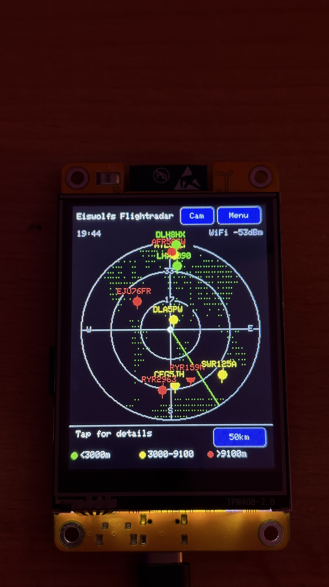

# Eiswolfs Flightradar (CYD)

A live ADS-B flight radar running on the ESP32 "Cheap Yellow Display" (CYD,
ESP32-2432S028), showing nearby aircraft on a rotating radar screen with
altitude/speed/model/route details and a proximity LED alert.

## 🚀 [Click here to open the Flightradar Web Flasher](https://github.io)

---

## Getting Started

### Option 1: Quick Web Installation (Recommended)
You can flash the firmware directly from your browser to your CYD display without installing any development tools:
1. Connect your "Cheap Yellow Display" to your computer using a USB cable.
2. Click the **Web Flasher link above** (requires Google Chrome, Microsoft Edge, or Opera).
3. Click the **Install** button on the web page, select your USB/COM port, and follow the instructions.

### Option 2: Manual Compilation (For Developers)
1. Open and compile the project using PlatformIO (`platform = espressif32`, `board = esp32dev`, `framework = arduino`).
2. Insert a FAT32-formatted microSD card into your display.
3. On first boot: Calibrate the touchscreen and configure your Wi-Fi via the built-in on-screen keyboard.

---

## Features
- **Live radar screen** – circular radar view, sized to the full screen width, with a rotating green sweep line
- **Real ADS-B data** via the free [adsb.fi](https://adsb.fi) API, refreshed every 8 seconds
- **Color-coded aircraft** by altitude (green `<10k ft`, yellow `10-30k ft`, red `>30k ft`) with an on-screen legend
- **Tap an aircraft** to open a detail panel: callsign, airline, aircraft model (via [hexdb.io](https://hexdb.io)), altitude/speed/distance/heading in both metric and aviation units, estimated seat count
- **Adjustable range** (10/25/50/100 km) via on-screen button
- **Touch-driven WiFi setup** and on-screen keyboard for first-time configuration, with up to 3 saved networks (see [WiFi Manager](#-wifi-manager-up-to-3-saved-networks) below)
- **Location presets** – save up to 3 fixed locations, or point the radar at any place in the world (see [Location Presets](#-location-presets) below)
- **IP-based geolocation** (no GPS module needed) to center the radar on your location
- **Proximity LED alert** – the onboard RGB LED blinks green when an aircraft is within 3 km (no speaker on this board, so this replaces an audible alert)
- **Dual-core design** – all networking (WiFi, ADS-B polling, aircraft detail lookups) runs on Core 0, while the display and touch input run on Core 1, so the UI never freezes during a network request
- Data (airline names, aircraft-type seat estimates) loaded from CSV files on the SD card, auto-seeded on first boot
- **6 languages** (English, German, French, Turkish, Spanish, Italian), selectable on first boot or anytime from the menu

## Feature Deep-Dive

### 📍 Location Presets
By default the device figures out where it is automatically (via IP geolocation).
Under **Menu → Flight Options → Location Presets** you can additionally save up
to 3 fixed locations and switch between them.

**Good to know:** only **one** location is ever active at a time – either "Auto"
or exactly one of the 3 presets. Tap an entry to make it the active one.

**The actual trick:** you don't have to enter *your own* location there – you can
enter the coordinates of **any place in the world** and the radar will show the
live air traffic *there* instead, regardless of where your device physically is.

**Examples:**
- Enter the coordinates of Milan-Malpensa Airport (`45.6306`, `8.7281`) and watch
  the traffic there while sitting at home.
- Save home, workplace, and a holiday house as 3 presets and switch between them
  with a single tap, without waiting for IP geolocation to re-run each time.
- More precise than IP geolocation (which is often only accurate to city level) –
  handy if the device lives permanently at one fixed spot and you know its exact
  coordinates.

A "?" info button right on the Location Presets screen explains all of this
again directly on the device.

### 📶 WiFi Manager (up to 3 saved networks)
Under **Menu → WiFi/Network** you can save up to 3 WiFi networks at once (not
just one). On boot, the device automatically connects to whichever one it can
currently see.

**Why would you need 3 networks if you're only ever in one place?**
- **Portable use:** take the device to the office, a friend's place, or a
  holiday home, and it connects automatically everywhere without re-entering
  passwords each time.
- **Guest network + main network:** many routers offer separate guest and main
  WiFi networks – save both, and the device just uses whichever is reachable.
- **Multiple access points/repeaters:** if you have several access points around
  the house (e.g. living room + workshop), the device automatically connects to
  whichever saved network it can currently reach.

Any saved network can be removed again at any time via the red "X", freeing up a
slot for a new one.

## ✈️ Flight Options — every function in detail

All the functions below are found under **Menu → Flight Options**.

### 📊 Statistics
Shows at a glance:
- **Aircraft logged today** – number of distinct aircraft first seen today
- **Aircraft logged all-time** – total across the entire runtime (all days combined)
- **Days with sightings** – how many days anything was logged at all
- **Average per day** – total count divided by number of days
- **Uptime** – how long the device has been running since the last restart

The **"Reset logbook data"** button (tap twice to confirm) permanently deletes all logged data.

### 📁 Logbook files
Lists the last several days from the logbook individually, with date and the number of aircraft logged that day. Handy for tracing the history over multiple days instead of only seeing the grand total.

### 📖 Flight logbook (ON/OFF)
When enabled, the device logs **every newly sighted aircraft** (timestamp, hex code, callsign, registration, type, distance, altitude) into a daily CSV file on the SD card. An aircraft is only logged once per day, even if it crosses the radar multiple times. Survives a same-day restart without logging already-seen aircraft twice. Turning it off saves SD card write cycles if you don't care about the statistics/history.

### 💚 LED heartbeat (ON/OFF)
A brief **green flash** of the RGB LED on every successful ADS-B data fetch (every 8 seconds) – a quick visual confirmation that the device is actively receiving data and hasn't frozen. Automatically overridden by an active proximity or emergency alert (which take priority), so the indicators never mix.

### 🔔 Proximity LED (ON/OFF)
The RGB LED **blinks green** whenever an aircraft comes within **3 km** (straight-line distance to the currently active location, see [Location Presets](#-location-presets)). Since the CYD board has no speaker, this replaces an audible alert. Handy for noticing something interesting flying nearby without having to watch the screen.

### 🚨 Emergency alert (ON/OFF)
Continuously monitors all visible aircraft for one of the three international **emergency squawk codes**:
- **7500** – hijacking
- **7600** – radio failure
- **7700** – general emergency

If the device detects one of these codes, the RGB LED **blinks red rapidly** (noticeably faster/more urgent than the green proximity blink), and a flashing red banner appears in the radar header showing the callsign and squawk code. Takes priority over all other LED indications (proximity, heartbeat).

### 📍 Location Presets
See the dedicated section above: [Location Presets](#-location-presets) – save up to 3 fixed locations, or enter any place in the world to watch the air traffic there.

### 🏢 Airline filter
Completely hides aircraft from specific airlines from the radar (they're also excluded from counts/logging). Up to **10 airlines** can be entered (by ICAO code, e.g. `DLH` for Lufthansa, `RYR` for Ryanair). Handy if you live near an airport and don't want certain high-frequency airlines cluttering the radar.

### 🚗 Hide ground vehicles (ON/OFF)
ADS-B data doesn't only contain aircraft – it can also include **airport ground vehicles** (follow-me cars, pushback tugs, etc., flagged by the API under a separate "C" category). This option hides them so the radar stays focused purely on air traffic.

### 📶 WiFi Manager
See the dedicated section above: [WiFi Manager](#-wifi-manager-up-to-3-saved-networks) – save up to 3 WiFi networks at once.

---

**Technical notes for the curious:**
- Flight data is re-fetched from [adsb.fi](https://adsb.fi) every **8 seconds**.
- Altitude color coding is fixed: **green** < 10,000 ft, **yellow** 10,000–30,000 ft, **red** > 30,000 ft.
- Radar radius is switchable between **10 / 25 / 50 / 100 km**.

## Hardware
- ESP32-2432S028 ("Cheap Yellow Display", CYD) – ILI9341 2.8" 240x320 touch TFT
- microSD card slot
