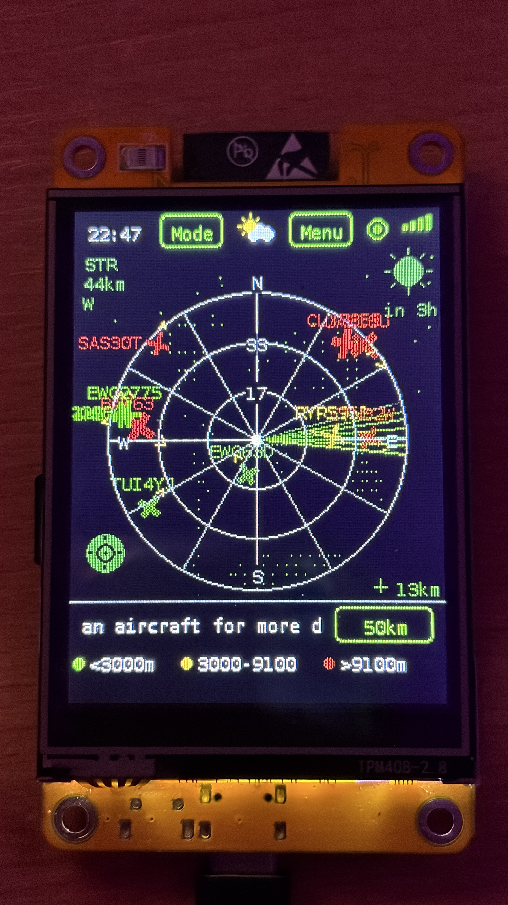

# Eiswolfs Flightradar (CYD)

A live ADS-B flight radar running on the ESP32 "Cheap Yellow Display" (CYD,
ESP32-2432S028), showing nearby aircraft on a rotating radar screen with
altitude/speed/model/route details and a proximity LED alert.

## Getting Started

You can flash the firmware directly from your browser to your CYD display without installing any development tools — just open the [Web Flasher](https://eiswolf-bg.github.io/eiswolfs-flightradar-CYD/) (requires Chrome, Edge, or Opera).

### Option 1: Quick Web Installation (Recommended)
1. Connect your "Cheap Yellow Display" to your computer using a USB cable.
2. Click the **Web Flasher link above**.
3. Click the **Install** button on the web page, select your USB/COM port, and follow the instructions.

**Driver note:** If your computer doesn't detect the CYD (no USB/COM port shows up), you likely need to install a driver for the board's CH340 USB-to-serial chip first:
- **Windows:** [CH341SER.EXE](https://www.wch-ic.com/downloads/CH341SER_EXE.html)
- **macOS:** [CH341SER_MAC.ZIP](https://www.wch-ic.com/downloads/CH341SER_MAC_ZIP.html)
- **Linux:** built into the kernel since version 5.x - no separate installation needed

### Option 2: Manual Compilation (For Developers)
1. Open and compile the project using PlatformIO (`platform = espressif32`, `board = esp32dev`, `framework = arduino`).
2. Insert a FAT32-formatted microSD card into your display.
3. On first boot: Calibrate the touchscreen and configure your Wi-Fi via the built-in on-screen keyboard.

**Guided first-time setup:** a Welcome screen with the animated radar graphic greets you first, followed by language selection, then a one-time (skippable) screen that explains why setting your exact location gives a much better experience than automatic IP-based location and offers to set it up right there via the address search. A final setup-complete screen then confirms everything is saved and ready, counting down automatically before entering the app (or tap to skip ahead).

**Tip:** for the best experience, set your exact location as a Location Preset (Menu → Flight Options → Location Presets → "+" → Search by address). Just type your address and the device looks up the exact coordinates for you automatically - no need to look anything up yourself. This is much more accurate than automatic IP-based location, which can easily be off by 20-30 km - you might hear a plane outside your window while the radar screen stays empty because the device thinks you're somewhere else entirely. With your precise location set, the proximity LED blinks in sync with aircraft you can actually hear overhead. You'll also be prompted to set this up right during first-time setup.

---

## Features
- **Live radar screen** – circular radar view, sized to the full screen width, with a rotating green sweep line; each aircraft marker's heading line ends in a small arrowhead, so its direction of travel is unambiguous at a glance. Twinkling background stars fill the space outside the radar circle.
- **Real ADS-B data** via the free [adsb.lol](https://adsb.lol) API, refreshed every 8 seconds
- **Color-coded aircraft** by altitude (green `<10k ft`, yellow `10-30k ft`, red `>30k ft`) with an on-screen legend
- **Tap an aircraft** to open a detail panel: callsign, airline, aircraft model (via [hexdb.io](https://hexdb.io)), flight route (origin/destination airport, resolved via a chain of three free lookup services for better coverage), altitude/speed/distance/heading/bearing in both metric and aviation units, estimated seat count, plus a "QR" button that shows a full-screen QR code linking to that flight's live-tracking page on FlightAware
- **Bearing indicator** – with an aircraft selected, a dotted line plus a heading-in-degrees label points from the radar center to the compass edge, showing exactly which direction to look to spot it in the sky (not to be confused with the aircraft's own heading arrow)
- **Empty-sky timer** – when no aircraft are currently in range, the info bar counts up how long the sky's been empty instead of showing the usual "tap for details" hint, which itself now also shows how many aircraft are currently visible
- **Adjustable range** (10/25/50/100 km) via on-screen button
- **Aircraft list view** – a sortable list (by distance, altitude, or callsign) of every aircraft currently in range, tap any row to jump straight to its detail panel (see [Aircraft List](#-aircraft-list) below)
- **Touch-driven WiFi setup** and on-screen keyboard for first-time configuration, with up to 3 saved networks (see [WiFi Manager](#-wifi-manager-up-to-3-saved-networks) below)
- **Location presets** – save up to 3 fixed locations, or point the radar at any place in the world, including a native in-device address search for setting your exact location (see [Location Presets](#-location-presets) below)
- **Aircraft watchlist** – track up to 5 specific flights by callsign, with a cyan radar ring and blue LED alert when one appears (see [Watchlist](#-watchlist) below)
- **Night dimming** – automatically dims the backlight, plus the radar's aircraft markers and sweep line, to a softer (but still readable) look between 22:00 and 06:00 local time (see [Night Dimming](#-night-dimming) below)
- **History chart** – a simple 7-day bar chart of logged aircraft counts, right next to the plain logbook file list (see [History Chart](#-history-chart) below)
- **Web export** – a small built-in web page (reachable via the device's IP while on the same WiFi, with its own "Logbook / WebUI" entry in Menu → System) to view, download and individually delete the flight logbook, in addition to a merged CSV of all days (see [Web Export](#-web-export) below)
- **Weather icon** – a small icon in the header shows the current conditions (sun, cloud, sun-behind-cloud, rain, snow, thunderstorm) for whichever location is currently active, including active location presets (see [Weather Icon](#-weather-icon) below)
- **IP-based geolocation** (no GPS module needed) to center the radar on your location
- **Proximity LED alert** – the onboard RGB LED blinks green when an aircraft is within 3 km (no speaker on this board, so this replaces an audible alert)
- **Dual-core design** – all networking (WiFi, ADS-B polling, aircraft detail lookups) runs on Core 0, while the display and touch input run on Core 1, so the UI never freezes during a network request
- Data (airline names, aircraft-type seat estimates) loaded from CSV files on the SD card, auto-seeded on first boot
- **6 languages** (English, German, French, Turkish, Spanish, Italian), selectable on first boot or anytime from the menu
- **Adjustable brightness** (10-100% in 10% steps, Menu → System → "Brightness") with a live preview as you tap
- **Metric/Imperial units** (Menu → Region → "Units") consistently applied across the radar range button, range ring labels, aircraft list, nearest-airport distance, and stats
- **IATA or ICAO airport codes** (same "Units" screen, or tap the route line directly in the aircraft detail panel) – choose whether the route shown in the aircraft detail panel (origin/destination) uses 3-letter IATA codes (e.g. "FRA") or 4-letter ICAO codes (e.g. "EDDF"); falls back to ICAO automatically if no IATA code is available for a given airport
- **Firmware version** is shown directly on the "Check for updates" button (Menu → System)
- **Backup & Reset** (Menu → System → "Backup & Reset") – back up or restore your settings, or fully reset the device (wipes all on-device data and re-runs first-time setup) - handy for testing or handing the device to someone else
- **Screen timeout with slider** (Menu → System → "Screen Timeout") – set how long until the display turns off after a period of no touches, from 1 to 15 minutes or "Never", using a drag slider instead of tapping through values one minute at a time
- **Idle screensaver** (same screen, off by default) – instead of turning the display off completely after the timeout, shows a dimmed starfield with the radar logo, a large clock, today's date (in your language's local format), and the firmware version, dimmed noticeably deeper than the regular night dimming; a tap wakes it back up
- **OTA firmware updates over WiFi** (Menu → System → "Check for update") – checks the latest GitHub release and, if newer, downloads and installs it directly on the device, no cable or web flasher needed. Update results are shown as a clear on-screen message that requires confirmation, with an explicit restart button on success
- **Automatic background update check** – the device quietly checks for new firmware every few minutes in the background; a small red dot (like an app badge) appears on the Menu button, the System tile, the "Check for update" button, and the sleep screen when a new version is available. Installing always still requires your explicit confirmation - nothing happens automatically
- **Quick header shortcuts** – tap the WiFi signal bars in the header to jump straight to WiFi settings, tap the app title for a QR code linking to this project's GitHub page, or tap the small clock to jump straight to the screen-timeout settings - the entire header is interactive
- **Live radar in the web UI** – scanning the QR code (or opening the device's IP) now shows a live radar with all currently visible aircraft at the top of the page, refreshing every few seconds, with the flight logbook below it as before (see [Web Export](#-web-export) below)
- **Sun-based night dimming** – the night dimming window now follows the actual sunrise/sunset time at your location instead of a fixed 10pm-6am window, so it matches how dark it actually is outside depending on the season
- **Heavy aircraft marker** – wide-body jets over 136 tonnes MTOW (e.g. A380, B747, B777) get their own marker (a larger circle with an outer ring) on both the device radar and the web UI radar, instead of the normal aircraft marker
- **Live flight tracking QR code** – a "QR" button in the aircraft detail panel shows a full-screen QR code linking straight to that flight's FlightAware live-tracking page, so you can pull it up on your phone in one scan
- **Most-seen aircraft ranking** – a "Top" button on the Statistics screen shows the 5 aircraft logged most often across your whole flight logbook (see [Most-Seen Aircraft](#-most-seen-aircraft) below)
- **METAR flight-weather report** – the Weather Info screen now also shows the raw METAR text for the nearest airport, right below the usual weather explanation (see [Weather Icon](#-weather-icon) below)
- **Radar Display** – choose between Green, Amber, or Blue for the radar screen (sweep line, panel border/text, buttons) under **Menu → System → "Radar Display"**, plus four independent, combinable extras: a CRT-Phosphor glow effect that fades *every* aircraft marker color (not just low-altitude/green ones) in and out as the sweep passes them, a Radar Pulse animation - an expanding ring from the radar center on every fresh data update, a "Nostalgic" mode with subtle CRT-style screen flicker and a soft corner vignette, and a Flight Trail that shows the selected aircraft's last few positions as a fading trail
- **OTA update changelog** – after a firmware update installs successfully, the confirmation screen now shows a short, scrollable list of what changed in that version
- **Sunrise/sunset times** – the Weather Info screen now also shows today's sunrise and sunset time for your currently active location, right below the METAR report
- **Short weather forecast** – the Weather Info screen also shows a short forecast (temperature and conditions) 3 hours ahead, and now scrolls automatically if the combined text (including a long METAR report) doesn't fit on one screen
- **Bearing to selected aircraft** – the detail panel now also shows a compass direction (e.g. "NE") alongside the numeric bearing, so you know which way to look without doing the math yourself
- **Quick watchlist add** – a "+"/"-" button in the aircraft detail panel, right next to the "QR" button, adds the currently shown aircraft to the [Watchlist](#-watchlist) with a single tap instead of typing its callsign manually
- **Show helicopters only** – a toggle under **Menu → Flight Options → Display Filters** filters the radar, aircraft list, and web live map down to helicopters (see [Show helicopters only](#-show-helicopters-only-onoff) below)
- **Show low-altitude aircraft only** – a toggle in the same **Display Filters** menu shows only aircraft currently below the green altitude threshold (see [Show low-altitude aircraft only](#-show-low-altitude-aircraft-only-onoff) below)
- **Empty-sky filter hint** – when the radar shows no aircraft because a filter (helicopters only, low-altitude only, airline filter) is hiding everything, the "empty sky" message now names which filter is active and is tappable, jumping straight to the Display Filters menu instead of leaving you guessing whether something's technically wrong
- **Reorganized menus** – the Flight Options menu is now grouped into category buttons: **Lists** (Aircraft List, Watchlist), **Stats & Logbook**, **LED Alerts**, **Display Filters** (airline filter, ground vehicles, helicopters only, low-altitude only), and **Tools** (Location Presets, Watchlist Alert); the System menu keeps its own Display/Tools categories
- **Optional GPS module support** – a new "GPS" button in [Location Presets](#-location-presets) turns reading from a connected GPS module on/off, so your location can follow your movement live instead of only being estimated via IP
- **Rotate screen (180°)** – a new switch under **Menu → System → Display** flips the screen and touch input upside down, useful for table-mount setups where the panel's limited vertical viewing angle otherwise washes out the radar circles when looked at from above
- **Squawk Watchlist** – store your own squawk codes (see [Watchlist](#-watchlist) below); as soon as any aircraft transmits a watched squawk, it gets the same cyan ring and blue LED alert as the callsign-based watchlist
- **ISS marker** – shows the International Space Station as a special marker whenever it's currently passing within your radar range, since it moves fast enough (~7.66 km/s) that it's usually only visible for a few seconds; can be turned off under **Menu → Flight Options → Display Filters**
- **Scanline overlay** – a subtle, always-on horizontal scanline pattern over the radar circle area for a classic CRT-radar look, without affecting the readability of buttons or text elsewhere on screen
- **Terminal-style boot sequence** – a short, simulated old-radar-system startup sequence ("Initializing transponder receiver...", etc.) plays before the usual splash screen on every boot
- **"Modes" button** – a quick shortcut right on the radar screen (next to the header clock) that jumps straight to the **Radar Display** menu, so the CRT-Phosphor/Radar Pulse/Nostalgic/Flight Trail toggles are reachable without digging through the System menu

## Feature Deep-Dive

### 📍 Location Presets
By default the device figures out where it is automatically (via IP geolocation).
Under **Menu → Flight Options → Location Presets** you can additionally save up
to 3 fixed locations and switch between them.

**Good to know:** only **one** location is ever active at a time – either "Auto"
or exactly one of the 3 presets. Tap an entry to make it the active one.

**Optional GPS module:** a "GPS" button next to "Auto" turns reading from a connected GPS module on/off (only has any effect when "Auto" is the active location). With GPS enabled and a module wired up, your location follows your movement live (e.g. while driving) instead of only being roughly estimated via IP - without a connected module, the button simply has no effect. Wiring: GPS module TX to GPIO22, GPS module RX to GPIO27, 3.3V and GND, 9600 baud (NMEA protocol). See the "?" info button on the Location Presets screen for the same details on-device.

**The actual trick:** you don't have to enter *your own* location there – you can
enter the coordinates of **any place in the world** and the radar will show the
live air traffic *there* instead, regardless of where your device physically is.

**Examples:**
- Enter the coordinates of Milan-Malpensa Airport (`45.6306`, `8.7281`) and watch
  the traffic there while sitting at home.
- Save home, workplace, and a holiday house as 3 presets and switch between them
  with a single tap, without waiting for IP geolocation to re-run each time.
- More precise than IP geolocation (which is often only accurate to city level) –
  handy if the device lives permanently at one fixed spot and you know its exact
  coordinates.

A "?" info button right on the Location Presets screen explains all of this
again directly on the device.

**Naming presets:** when adding a preset, you can optionally give it a name (e.g. "Home"), which is then shown in the overview instead of the raw coordinates.

The screen also shows the **nearest known airport** (from a built-in list of ~34 major airports worldwide) to whichever location is currently active - handy to see exactly where a foreign preset points to, or why a location has a lot of air traffic. If the airport name doesn't fit on one line, it scrolls horizontally like a marquee. This ticker is tappable (shown with a thin green border) - tapping it adds that airport directly as a new preset with its name and coordinates, using the same local airport database on the SD card, no internet lookup needed.

**Search by address:** when adding a preset ("+"), you can either enter coordinates manually or tap "Search by address" to type a plain address (e.g. "Main Street 12, 12345 Springfield") - the device geocodes it via the free OpenStreetMap Nominatim service and shows you the matching place to confirm before saving it as a preset. The address keyboard includes a format hint and punctuation keys (comma, hyphen, slash, period, apostrophe) so house numbers like "45/3" can actually be entered. This is much more accurate than automatic IP-based location, which can easily be off by 20-30 km. The preset-naming screen also shows example names (e.g. "Home, Work, Holiday home") so it's clear what's being asked for.

### 📶 WiFi Manager (up to 3 saved networks)
Under **Menu → WiFi/Network** you can save up to 3 WiFi networks at once (not
just one). On boot, the device automatically connects to whichever one it can
currently see.

**Why would you need 3 networks if you're only ever in one place?**
- **Portable use:** take the device to the office, a friend's place, or a
  holiday home, and it connects automatically everywhere without re-entering
  passwords each time.
- **Guest network + main network:** many routers offer separate guest and main
  WiFi networks – save both, and the device just uses whichever is reachable.
- **Multiple access points/repeaters:** if you have several access points around
  the house (e.g. living room + workshop), the device automatically connects to
  whichever saved network it can currently reach.

Any saved network can be removed again at any time via the red "X", freeing up a
slot for a new one.

### 🌙 Night Dimming
Between sunset and sunrise at your active location, the backlight automatically dims to a softer brightness level - still perfectly readable, but easier on the eyes if the device sits in a bedroom or living room around the clock. The dimming window follows the real sunrise/sunset time (calculated from your location and the current date), not a fixed clock window, so it automatically shifts earlier in winter and later in summer. Until the location or time of day is known (e.g. briefly after boot), it falls back to a fixed 10pm-6am window. This is separate from the inactivity screen timeout (**Menu → System → "Screen Timeout"**), which turns the display fully off after a period of no touch input, regardless of time of day - handy if you just want the flight logbook running in the background without needing the screen. Tapping the screen wakes it back up to your configured brightness (or the soft night level above, if it's still night).

Toggle it under **Menu → System → "Night dimming"**. When you tap the screen while it's night-dimmed, it wakes back up to the soft night level (not full brightness) if it's still night - no sudden bright flash in a dark room.

Since this update, the same night window also softens the **radar screen itself** — aircraft markers and the rotating sweep line switch to darker green/yellow/red tones, so the whole display is easier on the eyes at night, not just the backlight. No separate toggle needed - it uses the same **Night dimming** setting.

## ✈️ Flight Options — every function in detail

All the functions below are found under **Menu → Flight Options**.

### 📋 Aircraft List
Menu → Flight Options → **"Aircraft list"** (top entry) shows every aircraft currently visible on the radar as a scrollable, sortable list instead of dots — handy for a quick text overview instead of parsing the radar view. Shows callsign, altitude (color-coded the same way as the radar: green/yellow/red), and distance for each entry. A button at the top cycles the sort order through **distance → altitude → callsign**. Emergency squawks get a red border, watched aircraft (see [Watchlist](#-watchlist)) a cyan one, matching the radar's own markers. Tap any row to jump straight back to the radar with that aircraft's detail panel already open.

### 📊 Statistics
Shows at a glance:
- **Aircraft logged today** – number of distinct aircraft first seen today
- **Aircraft logged all-time** – total across the entire runtime (all days combined)
- **Days with sightings** – how many days anything was logged at all
- **Average per day** – total count divided by number of days
- **Uptime** – how long the device has been running since the last restart
- **Highest flight today** – callsign and altitude of whichever aircraft was logged at the greatest altitude today (the altitude at first sighting, not necessarily its current one), e.g. "DLH441 (38000 ft)"

The **"Reset logbook data"** button (tap twice to confirm) permanently deletes all logged data.

### 🏆 Most-Seen Aircraft
A "Top" button in the top-right of the Statistics screen opens a ranking of the **5 aircraft logged most often** across the entire flight logbook (all days combined), showing each one's registration (or hex code if unknown) and total sighting count - handy for spotting the "regulars" that pass over again and again.

### 📈 History Chart
Shows the last up to **7 days** from the flight logbook as a simple bar chart – a quick visual complement to the plain number list in Logbook files. Bar height is relative to the busiest day shown, with the exact count printed above each bar and the day-of-month printed below it.

**Good for:** spotting at a glance which days were busier than others, without having to compare numbers row by row.

A "?" info button on the History chart screen explains how it works directly on the device.

### 📁 Logbook files
Lists the last several days from the logbook individually, with date and the number of aircraft logged that day. Handy for tracing the history over multiple days instead of only seeing the grand total. Each file has its own red "X" to delete it individually.

### 🌐 Web Export
A small built-in web page lets you view a live radar and export the flight logbook from any browser on the same WiFi network – handy for checking traffic from your phone or opening the logbook in Excel, Numbers, or Google Sheets. It starts automatically in the background as soon as the device connects to WiFi.

**Live radar:** the top of the page shows a canvas radar with all currently visible aircraft, refreshing automatically every 8 seconds (simple polling, no app or special software needed) – same distance rings, altitude colors, marker shapes (ground vehicles, rotorcraft, Heavy aircraft), and full compass directions (N/E/S/W) as the device display, plus a full-page twinkling starfield background (same look as the web installer). Tap or click an aircraft to open an info panel with callsign, altitude, speed, distance, bearing, heading, squawk, and – if the callsign is known – a tracking link (route, details, photo) via FlightAware. Distances and the radius selector automatically follow the device's Metric/Imperial units setting. The radius selector (10/25/50/100 km or nm) above the radar actually zooms the web view independently of the device's own range setting – the device temporarily queries at the largest configured range while the Live Radar page is open, so a wider web selection can show aircraft beyond what the device itself is currently set to.

**Logbook:** below the radar, the page lists every logged day with its aircraft count, a download link for the **merged CSV** (all days combined), and per-day **download/delete** links for each individual day's file.

**How to use it:** while your computer or phone is on the same WiFi network as the device, open a browser and go to the device's IP address (e.g. `http://192.168.1.42/`).

Don't know the device's current IP? **Menu > System > "Logbook / WebUI"** shows it live on the device, along with a short explanation of the page (the "?" info button on the **Logbook files** screen also still shows it). While connected to WiFi, this screen also shows a **QR code** for the page's URL, so you can open it on your phone without typing the IP address by hand.

### ☀️ Weather Icon
A small icon in the header (where the camera button used to be) shows the current weather conditions – sun, cloud, sun-behind-cloud, rain, snow, or thunderstorm – drawn entirely with simple shapes, no image files or extra fonts needed.

It always follows whichever location is currently active, including active [location presets](#-location-presets) – switch the active preset to e.g. Milan or Tokyo and the icon updates to show that location's weather.

Powered by the free [Open-Meteo](https://open-meteo.com) API (no API key needed). Refreshed automatically in the background every 10 minutes, or immediately after switching to a different location.

Tap the icon for a small info popup explaining that the shown weather always reflects your currently active location. That same popup also shows the **raw METAR text** for the nearest airport (from the free [aviationweather.gov](https://aviationweather.gov) data API), fetched in the same background cycle as the icon weather - handy if you're used to reading METARs and want the exact report instead of just an icon. Below that, it also shows today's **sunrise and sunset time** for the active location, and a **short forecast** (temperature and conditions) 3 hours ahead. The popup scrolls automatically if all of this doesn't fit on one screen.

### 📖 Flight logbook (ON/OFF)
When enabled, the device logs **every newly sighted aircraft** (timestamp, hex code, callsign, registration, type, distance, altitude) into a CSV file on the SD card. An aircraft is only logged once per activation, even if it crosses the radar multiple times.

**Off by default, with a safety net:** because an unnoticed, permanently running logbook can quietly fill up the SD card and slow down the logbook menus, this is **disabled by default** and comes with two safeguards:
- Turning it on shows a full-screen warning explaining the behavior below, which you have to confirm.
- Once on, it **automatically switches off again after 24 hours** – and stays off after a restart unless it was actually turned on with a valid timestamp (so it can never silently keep running forever, even across power cycles or firmware updates).

Each time you turn it on, a **new CSV file** is created for that session (e.g. `2026-08-06.csv`, or `2026-08-06_2.csv` for a second activation on the same day) instead of endlessly appending to one growing file – see [Logbook files](#-logbook-files) above for deleting them individually. Turning it off saves SD card write cycles if you don't care about the statistics/history.

### 💚 LED heartbeat (ON/OFF)
A brief **green flash** of the RGB LED on every successful ADS-B data fetch (every 8 seconds) – a quick visual confirmation that the device is actively receiving data and hasn't frozen. Automatically overridden by an active proximity or emergency alert (which take priority), so the indicators never mix.

### 🔔 Proximity LED (ON/OFF)
The RGB LED **blinks green** whenever an aircraft comes within **3 km** (straight-line distance to the currently active location, see [Location Presets](#-location-presets)). Since the CYD board has no speaker, this replaces an audible alert. Handy for noticing something interesting flying nearby without having to watch the screen.

### 🚨 Emergency alert (ON/OFF)
Continuously monitors all visible aircraft for one of the three international **emergency squawk codes**:
- **7500** – hijacking
- **7600** – radio failure
- **7700** – general emergency

If the device detects one of these codes, the RGB LED **blinks red rapidly** (noticeably faster/more urgent than the green proximity blink), and a flashing red banner appears in the radar header showing the callsign and squawk code. Takes priority over all other LED indications (proximity, heartbeat).

### 🎯 Watchlist
Track up to **5 specific flights** by their exact callsign (e.g. `DLH441`) - unlike the Airline Filter, which matches whole airlines, this targets one specific flight. As soon as a watched aircraft appears anywhere within the current radar range, it gets a **cyan ring** on the radar and the **RGB LED blinks blue** - handy for spotting a particular flight, e.g. when someone you know is arriving. Takes priority over the normal proximity alert, but not over an emergency squawk. Add flights either via Menu → Flight Options → **"Watchlist"** (manual callsign entry) or with a single tap on the "+"/"-" button in an aircraft's detail panel on the radar screen. Turn the alert on/off separately under **"Watchlist alert"**.

**Squawk Watchlist:** a separate, similarly-structured list (Menu → Flight Options → **"Watchlist"**, right next to the callsign watchlist) lets you store up to 5 four-digit octal squawk codes instead of callsigns - e.g. a code your local ATC uses for a specific purpose. As soon as any aircraft transmits a watched squawk, it triggers the exact same cyan-ring-plus-blue-LED alert as the callsign watchlist. Emergency squawks (7500/7600/7700) are always handled separately by the red emergency alarm, regardless of this list.

### 📍 Location Presets
See the dedicated section above: [Location Presets](#-location-presets) – save up to 3 fixed locations, or enter any place in the world to watch the air traffic there.

### 🏢 Airline filter
Completely hides aircraft from specific airlines from the radar (they're also excluded from counts/logging). Up to **10 airlines** can be entered (by ICAO code, e.g. `DLH` for Lufthansa, `RYR` for Ryanair). Handy if you live near an airport and don't want certain high-frequency airlines cluttering the radar.

### 🚗 Hide ground vehicles (ON/OFF)
ADS-B data doesn't only contain aircraft – it can also include **airport ground vehicles** (follow-me cars, pushback tugs, etc., flagged by the API under a separate "C" category). This option hides them so the radar stays focused purely on air traffic.

When shown, ground vehicles render as distinct **blue square markers** on the radar screen instead of the normal aircraft marker, with a matching entry in the legend - so they're never mistaken for a low-flying aircraft.

Helicopters (ADS-B emitter category "A7") get their own marker too - a filled circle with a rotor cross instead of the usual arrowhead, since a hovering helicopter doesn't have a meaningful "forward heading" to point in.

"Heavy" aircraft (category "A5" - wide-body jets over 136 tonnes MTOW, e.g. A380, B747, B777) also get a distinct marker - a larger circle with an outer ring plus the usual heading line, so they stand out at a glance from smaller aircraft.

### 🚁 Show helicopters only (ON/OFF)
Filters the radar, the [Aircraft list](#-aircraft-list), and the Live Radar web page down to helicopters only (ADS-B emitter category "A7"), hiding all other aircraft. Off by default. Handy if you're specifically interested in rotorcraft traffic (medevac, police, sightseeing tours) rather than the usual fixed-wing airliners passing overhead.

### 🛬 Show low-altitude aircraft only (ON/OFF)
Filters the radar down to aircraft currently below the green altitude threshold (the same cutoff used for the green marker color, see [Color-coded aircraft](#color-coded-aircraft) above). Ground vehicles are never included by this filter, regardless of the separate "Show ground vehicles" setting. Off by default. Found in **Menu → Flight Options → Display Filters**.

### 📶 WiFi Manager
See the dedicated section above: [WiFi Manager](#-wifi-manager-up-to-3-saved-networks) – save up to 3 WiFi networks at once.

---

**Technical notes for the curious:**
- Flight data is re-fetched from [adsb.lol](https://adsb.lol) every **8 seconds**.
- Altitude color coding is fixed: **green** < 10,000 ft, **yellow** 10,000–30,000 ft, **red** > 30,000 ft.
- Radar radius is switchable between **10 / 25 / 50 / 100 km**.

## Hardware
- ESP32-2432S028 ("Cheap Yellow Display", CYD) – ILI9341 2.8" 240x320 touch TFT
- microSD card (FAT32) for settings, WiFi credentials, and lookup tables
- No GPS, no speaker required – uses IP geolocation and the onboard RGB LED

### Pinout used
| Function | Pins |
|---|---|
| TFT (VSPI) | MISO=12, MOSI=13, SCLK=14, CS=15, DC=2, BL=21 |
| Touch (XPT2046) | CLK=25, CS=33, MOSI=32, MISO=39, IRQ=36 |
| microSD (HSPI) | CLK=18, MISO=19, MOSI=23, CS=5 |
| RGB LED (active-low) | R=4, G=16, B=17 |

## Data sources
- Aircraft positions: [adsb.lol](https://adsb.lol) (free, no API key)
- Aircraft model lookups: [hexdb.io](https://hexdb.io) (free, community-maintained, rate-limited)
- Location: [ip-api.com](https://ip-api.com) (free IP geolocation)

## Disclaimer
Aircraft model and seat-count data are estimates from community databases and
local lookup tables, not live/official figures. This project is for hobby use
and is not intended for navigation or safety-critical purposes.

## License
MIT (or add your preferred license here)
