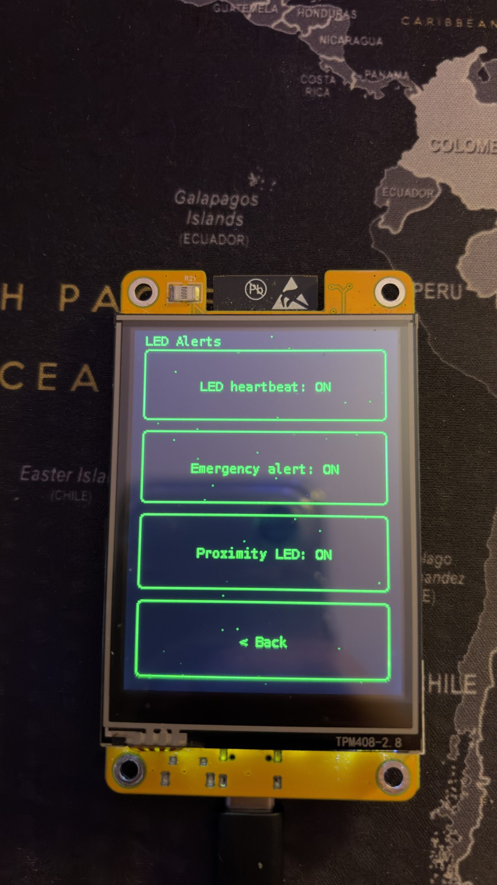
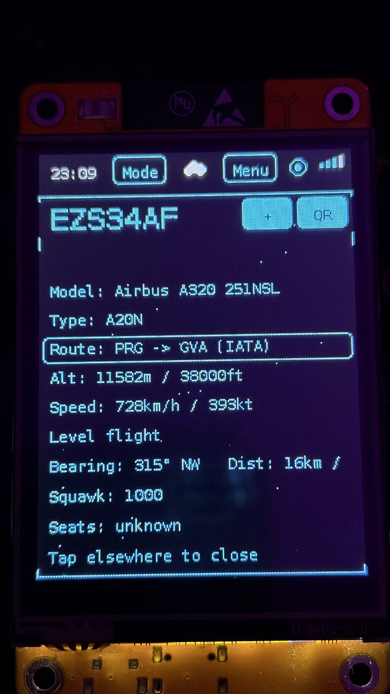
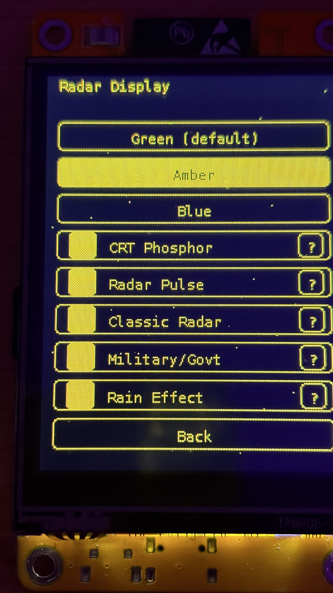
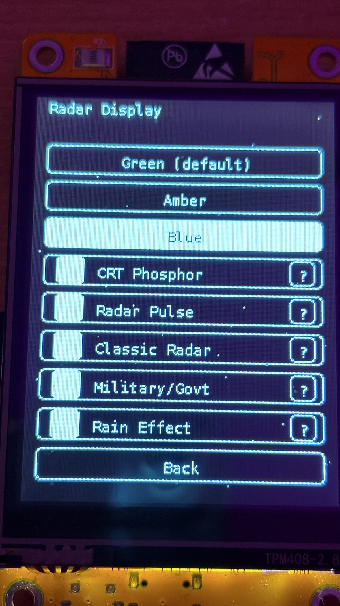
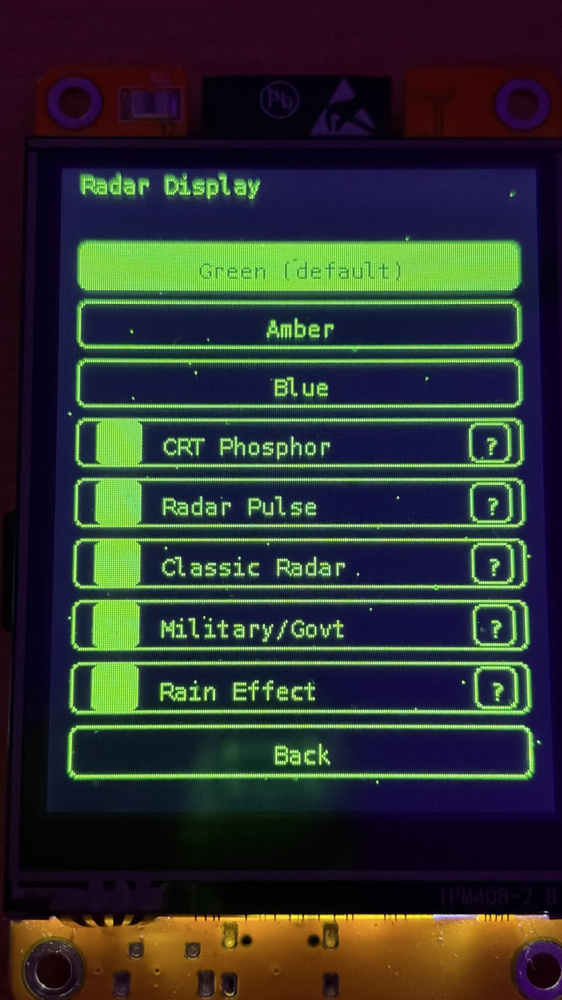
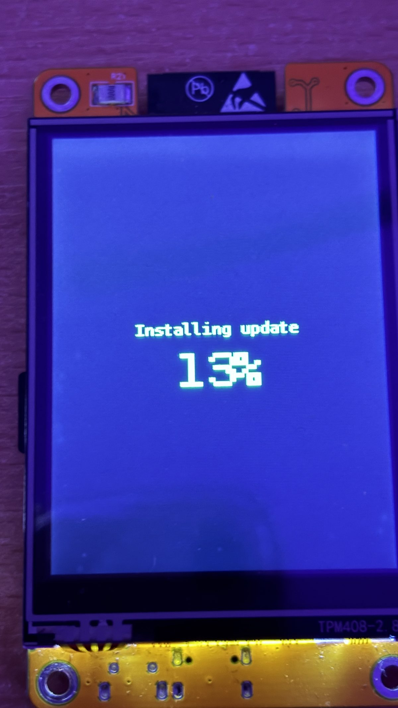
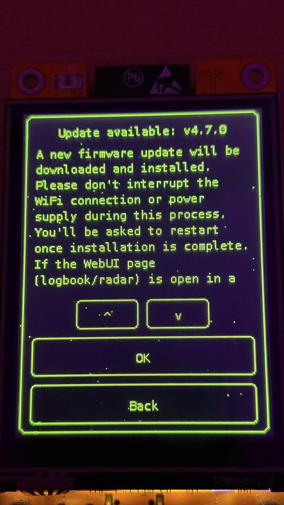

# 📷 Photo Gallery

A few more photos of Eiswolfs Flightradar (CYD) in action.

[← Back to README](../README.md)

---

**Alerts** – proximity and watchlist alert indicators on the radar screen.

---

**Aircraft detail view** – model, altitude, speed, route, and squawk for the selected aircraft.

---

**Color theme: Amber**

---

**Color theme: Blue**

---

**Color theme: Green**

---

**OTA update in progress**

---

**OTA update complete**
